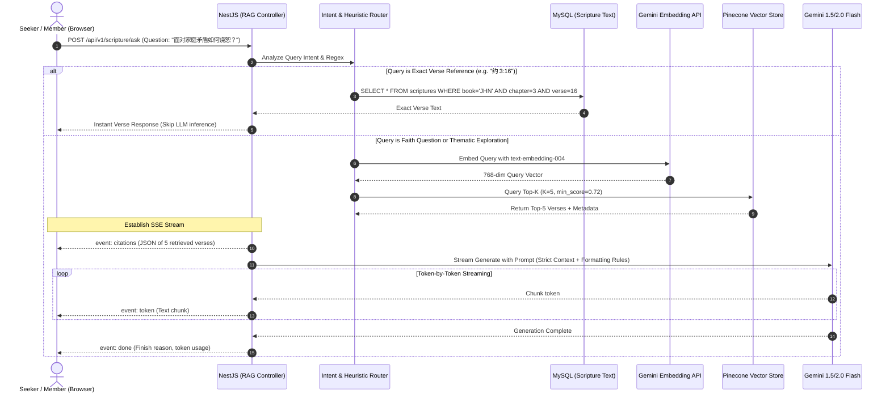
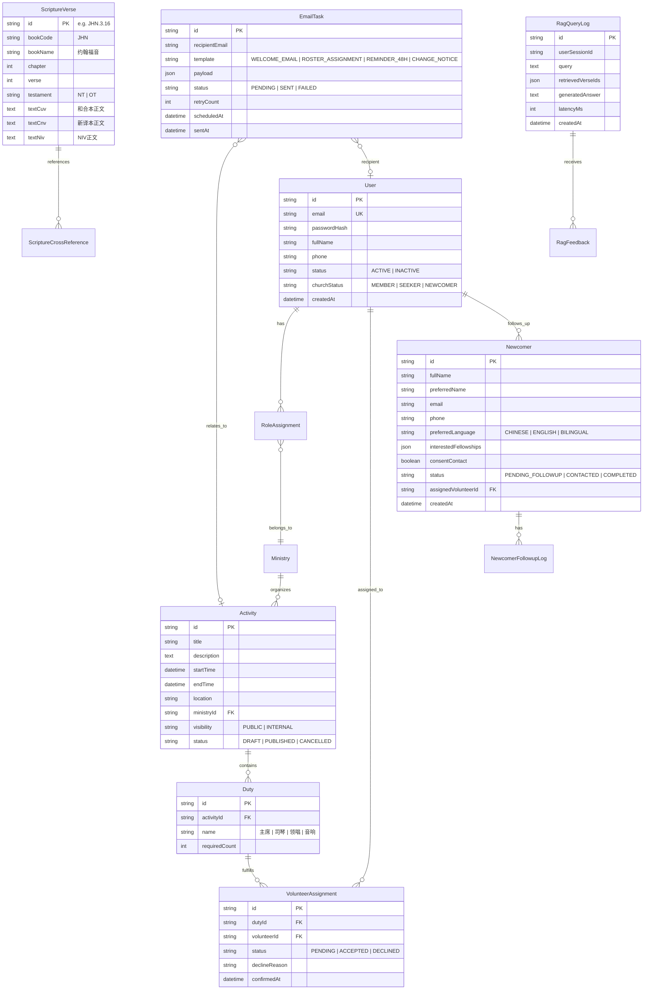

# HCMC Church Management System — System Architecture

This document specifies the technical architecture for the **Hamilton Chinese Methodist Church (HCMC / 漢美頓懷恩堂)** system, incorporating core church management capabilities with a modern **Retrieval-Augmented Generation (RAG) Scripture & Faith Search engine**, all optimized to run sustainably under strict **Free-Tier hosting environments**.

---

## 1. High-Level Container Architecture

The system adopts a decoupled **Modular Monolith** architecture. The frontend Single-Page Application (SPA) communicates via HTTPS REST APIs and Server-Sent Events (SSE) with a NestJS backend service.

```mermaid
graph TD
    subgraph Client Tier [Client Tier - Mobile & Desktop Browsers]
        V[Visitors & Seekers]
        M[Church Members]
        Admin[Volunteers & Pastors]
    end

    subgraph CDN & Hosting [Static Web Tier - Render Static / Vercel]
        SPA[React 18 + Vite + TypeScript\nTailored Component Library]
    end

    subgraph Backend Tier [Application Tier - Render Web Service]
        Nest[NestJS Application Server\nModular Monolith in TypeScript]
        
        subgraph Modules [NestJS Internal Modules]
            AuthMod[Auth & RBAC Module]
            NewcomerMod[Newcomer & Follow-up Module]
            CalendarMod[Calendar & Activities Module]
            RosterMod[Volunteer Roster Module]
            EmailTaskMod[Email Queue & Retry Module]
            RAGMod[RAG & Scripture Module]
        end
        
        Nest --> AuthMod
        Nest --> NewcomerMod
        Nest --> CalendarMod
        Nest --> RosterMod
        Nest --> EmailTaskMod
        Nest --> RAGMod
    end

    subgraph Data Tier [Free-Tier Storage Layer]
        MySQL[(Aiven MySQL 8.0 Free\nRelational Entities & Scripture Text)]
        Pinecone[(Pinecone Starter / Qdrant Free\nVector Store ~15k Scripture Chunks)]
    end

    subgraph External Services [Cloud & AI APIs]
        Gemini[Google AI Studio\nGemini 1.5/2.0 Flash + text-embedding-004]
        Resend[Resend Free API\nTransactional Emails]
        CronJob[cron-job.org\nExternal Scheduled Webhooks]
    end

    Client Tier -->|HTTPS / Browsing| SPA
    SPA -->|REST JSON API & SSE Stream| Nest
    
    NewcomerMod & CalendarMod & RosterMod -->|Prisma ORM| MySQL
    EmailTaskMod -->|Transactional API| Resend
    CronJob -->|Periodic Ping / Trigger| EmailTaskMod

    RAGMod -->|Embeddings & LLM Streaming| Gemini
    RAGMod -->|Vector Similarity Query| Pinecone
    RAGMod -->|Direct Chapter Lookup| MySQL
```

---

## 2. RAG Scripture & Faith Search Pipeline

The RAG engine is designed around **theological grounding, sub-second perceived latency, and anti-hallucination**.



### 2.1 The Anti-Hallucination Prompt Architecture
To ensure theological fidelity, the prompt enforces strict boundaries:
```text
[SYSTEM ROLE]
You are a faithful and pastoral biblical assistant for Hamilton Chinese Methodist Church (漢美頓懷恩堂).
Your duty is to answer questions strictly grounded in the provided Scripture passages.

[STRICT GUIDELINES]
1. Base your answer EXCLUSIVELY on the provided [CONTEXT VERSES].
2. Every major claim or encouragement MUST be followed by an exact citation tag in brackets, e.g. [以弗所书 4:32].
3. DO NOT fabricate Bible chapters, verses, or theological theories not supported by the context.
4. If the provided verses do not contain enough information to answer the question faithfully, state:
   "在目前的经文指引中未直接涵盖该问题，建议您咨询教会牧者或参与团契查经讨论。"
5. Tone: Pastoral, warm, gentle, and respectful to seekers.
```

---

## 3. Database Entity Relationship Diagram (ERD)

The relational schema is managed with **Prisma ORM** targeting MySQL:



---

## 4. Free Deployment Strategy & Resource Quotas

To ensure $0/month operational costs while maintaining production quality for church pilots:

| Component | Platform | Free Plan Limits | Optimization & Safety Measures |
| :--- | :--- | :--- | :--- |
| **Frontend** | Render Static / Vercel | 100 GB bandwidth / mo | Pre-compressed Vite build, CDN edge caching |
| **Backend** | Render Free Web Service | 512 MB RAM, spins down after 15m inactivity | - Lightweight NestJS build (no heavy native vector libs in memory)<br>- cron-job.org pings `/health` every 10 min to minimize cold starts<br>- Frontend displays smooth skeleton loader on initial wake-up |
| **Database** | Aiven for MySQL Free | 1 CPU, 1 GB RAM, 5 GB storage | - Strict connection pooling (`connection_limit=5`)<br>- Indexes on `(bookCode, chapter, verse)` and `status` |
| **Vector DB** | Pinecone Starter / Qdrant Cloud | 1 index, up to 100k vectors, 1 GB | - Bible is 31,102 verses; chunked into ~15k chunks<br>- Total index size is ~100MB, consuming only ~10% of free limit |
| **LLM Inference** | Google AI Studio (Gemini) | 15 RPM, 1,500 requests/day, 1M TPM | - Cache frequent queries (e.g. "十诫是哪些")<br>- IP-based rate limiter (10 req/min for public visitors)<br>- Instant regex bypass for specific verse lookups |
| **Transactional Email** | Resend Free | 100 emails/day, 3,000/month | - Max daily expected church traffic is ~15 emails, easily within limits |
| **Scheduler** | cron-job.org | Free unlimited triggers | - Secure webhook pinging `/api/v1/tasks/process-emails` every 10 mins |

---

## 5. Security & Privacy Safeguards

1. **Newcomer Privacy**: Contact details (email, phone, follow-up notes) are protected by NestJS Guards. Only authorized reception coordinators and church pastors can view or export records.
2. **One-Time Email Action Tokens**: Volunteers can accept or decline assignments directly from emails without logging into an account, using cryptographically signed HMAC tokens with expiration dates (`exp = activity_start_time`).
3. **Public Search Rate Limiting**: Utilizes `nestjs/throttler` in-memory store to prevent malicious draining of Gemini API quotas.
4. **Data Isolation for Portfolio**: Demonstrations will use seeded fictional church rosters and mock attendees to avoid exposing real congregation information.
